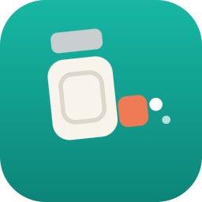
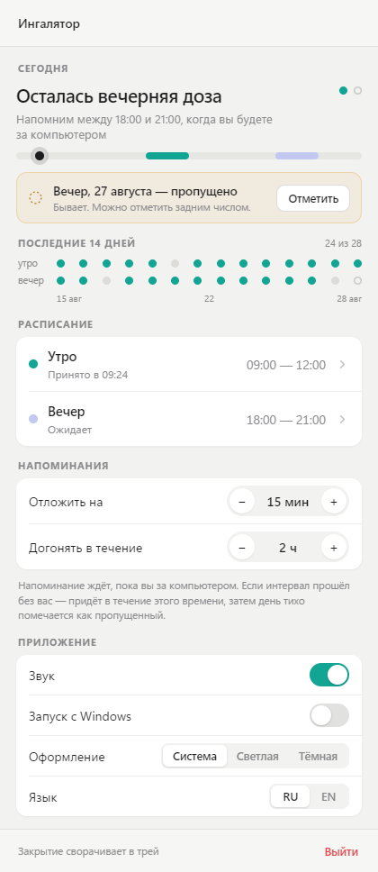
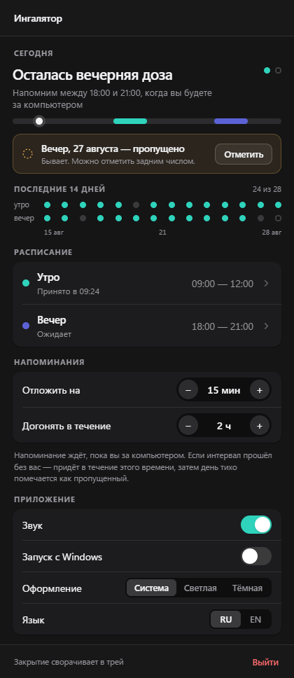
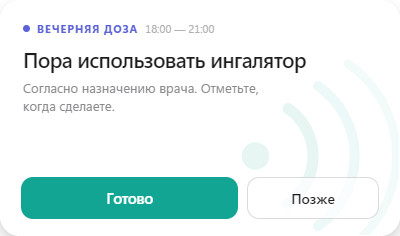
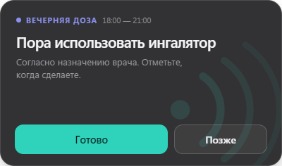
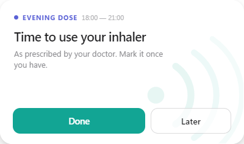
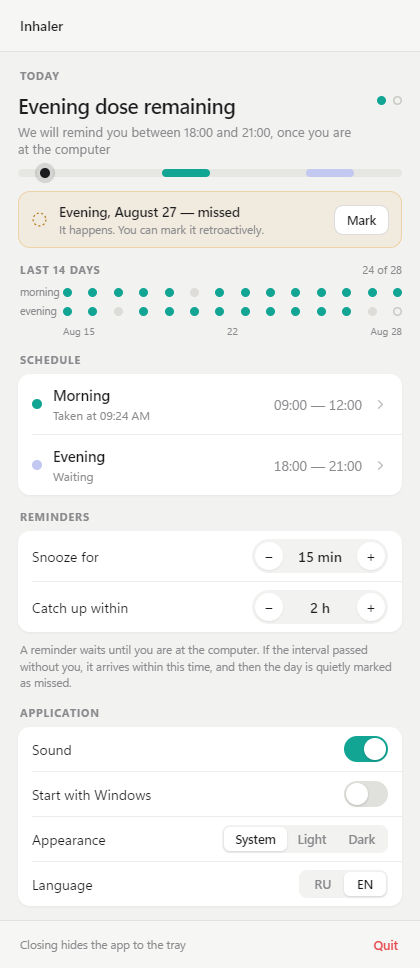

<div align="center">



# Inhaler Reminder

**Тихое напоминание об ингаляторе для Windows — локально, в системном трее**
<br>
*A quiet inhaler reminder for Windows — local, in the system tray*

[](https://github.com/Mixalblch/inhaler-reminder/actions/workflows/ci.yml)
[](https://github.com/Mixalblch/inhaler-reminder/releases/latest)
[](#license)

[Русский](#русский) · [English](#english)




</div>

---

## Русский

Приложение напоминает воспользоваться ингалятором в два заданных интервала — утром и вечером. Живёт в системном трее, работает полностью локально и ведёт историю приёмов за последние две недели.

Оно намеренно узкое: это не система управления лекарствами, а ровно два напоминания в день.

### Как это работает

Напоминание не приходит вслепую. Приложение ждёт, пока вы окажетесь за компьютером, и только тогда показывает небольшое окно поверх остальных.

Если интервал прошёл, а вас не было — есть период догона (по умолчанию 2 часа). По его истечении день тихо помечается как пропущенный, без повторных попыток достучаться.




Любое действие обратимо: после «Готово» появляется «Отменить», а пропущенную дозу можно отметить задним числом — и эту отметку тоже отменить.

### Возможности

- **Два интервала в сутки** — утренний и вечерний, каждый включается отдельно
- **История за 14 дней** — принято, пропущено, ожидает; дни до установки остаются «нет данных», а не помечаются пропущенными
- **Отсрочка** — 15 / 30 / 60 минут прямо из окна напоминания
- **Светлая и тёмная темы** плюс режим «Система»
- **Русский и английский** интерфейс
- **Автозапуск с Windows** — приложение стартует сразу в трее
- **Полностью локально** — ни аккаунтов, ни облака, ни аналитики; настройки и история лежат в вашем профиле пользователя

### Установка

Скачайте `.exe` из [последнего релиза](https://github.com/Mixalblch/inhaler-reminder/releases/latest) и запустите. Установка не требуется — это portable-сборка.

Закрытие окна сворачивает приложение в трей. Выйти полностью можно из меню трея или кнопкой «Выйти».

> Windows SmartScreen может предупредить о неизвестном издателе: сборка не подписана сертификатом. Нажмите «Подробнее» → «Выполнить в любом случае».

### Разработка

```bash
npm install
npm start
```

| Команда | Что делает |
| --- | --- |
| `npm start` | Запустить приложение |
| `npm test` | Тесты: конфигурация, история, планировщик, автозапуск, дизайн-контракт |
| `npm run smoke` | Проверить, что приложение поднимается |
| `npm run dist` | Собрать portable `.exe` в `dist/` |
| `npm run screenshots` | Пересобрать скриншоты для README |
| `npm run capture` | Снять QA-снимки и отчёт о взаимодействиях в `qa/` |
| `npm run render-icon` | Перегенерировать иконки из `assets/icon-source.svg` |

Каждый пуш в `main`, прошедший проверки, поднимает patch-версию, собирает `.exe` и публикует новый релиз. Чтобы прогнать проверки без публикации, добавьте `[no release]` в сообщение коммита. Pull request собирается так же, но ничего не публикует.

> После публикации бот дописывает в `main` коммит с новой версией, поэтому перед следующим пушем сделайте `git pull`.

Интерфейс реализует направление Claude Design `2a — Дыхание`; подробности решений и правила проверки — в [DESIGN.md](DESIGN.md).

### Оговорка

Это инструмент напоминания, а не медицинский совет. Придерживайтесь назначений вашего врача.

---

## English

The app reminds you to use your inhaler during two configured intervals — morning and evening. It lives in the system tray, runs entirely locally, and keeps a two-week record of what you took.

It is deliberately narrow: not a medication manager, just two reminders a day.

### How it works

A reminder never fires into an empty room. The app waits until you are actually at the computer, then shows a small window above your work.

If the interval passed while you were away, there is a catch-up period (2 hours by default). Once that elapses, the day is quietly marked as missed rather than chased.



Nothing is a one-way door: **Done** turns into an **Undo**, and a missed dose can be marked retroactively — which can be undone too.

### Features

- **Two intervals a day** — morning and evening, each toggled independently
- **14-day history** — taken, missed, waiting; days before install stay "no data" rather than counting against you
- **Snooze** — 15 / 30 / 60 minutes straight from the reminder
- **Light and dark themes**, plus a System option
- **Russian and English** interface
- **Start with Windows** — launches straight into the tray
- **Entirely local** — no accounts, no cloud, no analytics; settings and history stay in your user profile



### Install

Download the `.exe` from the [latest release](https://github.com/Mixalblch/inhaler-reminder/releases/latest) and run it. There is no installer — it is a portable build.

Closing the window hides the app to the tray. Quit fully from the tray menu or the **Quit** button.

> Windows SmartScreen may warn about an unknown publisher — the build is not code-signed. Choose **More info** → **Run anyway**.

### Development

```bash
npm install
npm start
```

| Command | What it does |
| --- | --- |
| `npm start` | Run the app |
| `npm test` | Config, history, scheduler, autostart, and design-contract tests |
| `npm run smoke` | Check that the app boots |
| `npm run dist` | Build the portable `.exe` into `dist/` |
| `npm run screenshots` | Regenerate the README screenshots |
| `npm run capture` | Write QA screenshots and an interaction report to `qa/` |
| `npm run render-icon` | Regenerate the icons from `assets/icon-source.svg` |

Every push to `main` that passes the checks bumps the patch version, builds the executable, and publishes a release. Put `[no release]` in a commit message to run the checks without publishing. Pull requests build the same way and publish nothing.

> Publishing commits the new version back to `main`, so `git pull` before your next push.

The interface implements Claude Design direction `2a — Дыхание` — see [DESIGN.md](DESIGN.md) for the decisions and the checks that hold them in place.

### Disclaimer

This is a reminder tool, not medical advice. Follow your doctor's prescription.

---

## License

MIT
